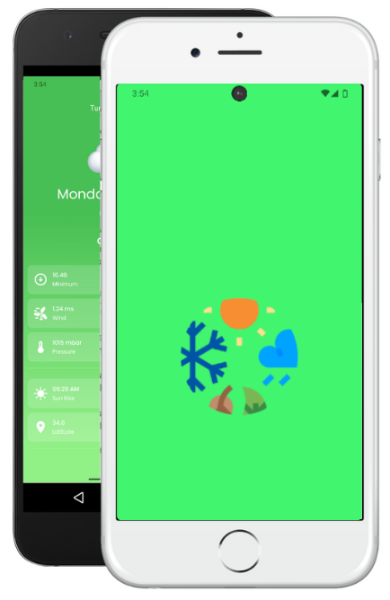
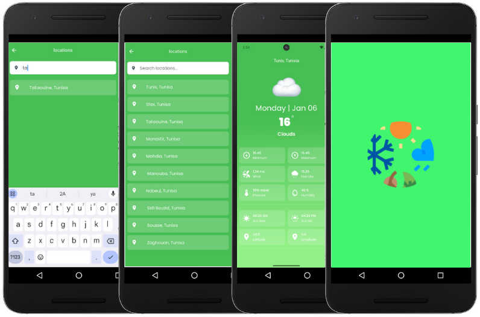

<h1 align="center"> Weather Flutter App </h1> <br>
<p align="center">
  <a href="https://flutter.dev/">
    
  </a>
</p>

<p align="center">
  Build for any screen .
</p>


<!-- START doctoc generated TOC please keep comment here to allow auto update -->
<!-- DON'T EDIT THIS SECTION, INSTEAD RE-RUN doctoc TO UPDATE -->
## Table of Contents

- [Introduction](#introduction)
- [Features](#features)
- [About](#about)
- [Feedback](#feedback)
- [Build Process](#build-process)

<!-- END doctoc generated TOC please keep comment here to allow auto update -->

## Introduction

[](https://flutter.dev/)


[](https://github.com/ahmedzghal-dev)
[](https://www.linkedin.com/in/ahmed-zghal/)


Welcome to the Weather App — a beautifully designed and user-friendly Flutter application that provides real-time weather updates for any location worldwide. This app leverages modern UI design principles and integrates powerful weather APIs to deliver accurate forecasts, current temperature, humidity, wind speed, and more.

**Available for Android.**

<p align="center">
  
</p>

## Features

A few of the things you can do with GitPoint:

* Responsive Design
* Custom Widgets
* Splash Screen
* Search Functionality
* GetX for State Management and Dependency Injection
* MVVM (Model-View-ViewModel) Architecture
* Error Handling and Loading Indicators
* Weather API Integration


<p align="center">
  
</p>


## About the Weather App

- The Weather App is a cross-platform Flutter application that provides real-time weather updates and forecasts for locations worldwide. With an intuitive and dynamic user interface, it displays current weather conditions, forecasts, and temperature data. The app supports search functionality for any city or location and features a sleek light/dark mode design. Built using GetX for state management and MVVM architecture, the app ensures a clean, maintainable structure while offering a seamless user experience with smooth animations and real-time weather data integration.


## Feedback

Feel free to send us feedback on [Linkedin](https://www.linkedin.com/in/ahmed-zghal/). Feature requests are always welcome.


## Build Process

1. Ensure you have the following tools installed on your system:
    - Flutter SDK (latest stable version)
    - Android Studio or Visual Studio Code (with Flutter and Dart plugins)
    - Java Development Kit (JDK)

2. Clone the Repository

    ``` git clone https://github.com/ahmedzghal-dev/Weather-Flutter-App ```
    ``` cd weather-app  ```

3. Install Dependencies
    
    ``` flutter pub get ```

4. Set Up an Android Emulator or Connect a Physical Device
    - Open Android Studio and set up a virtual device (AVD)
    - Alternatively, connect a physical Android device via USB and enable USB debugging

5. Run the Application
    
    ``` flutter run  ```

6. Build the APK (Release Version)

    ```flutter build apk --release  ```


